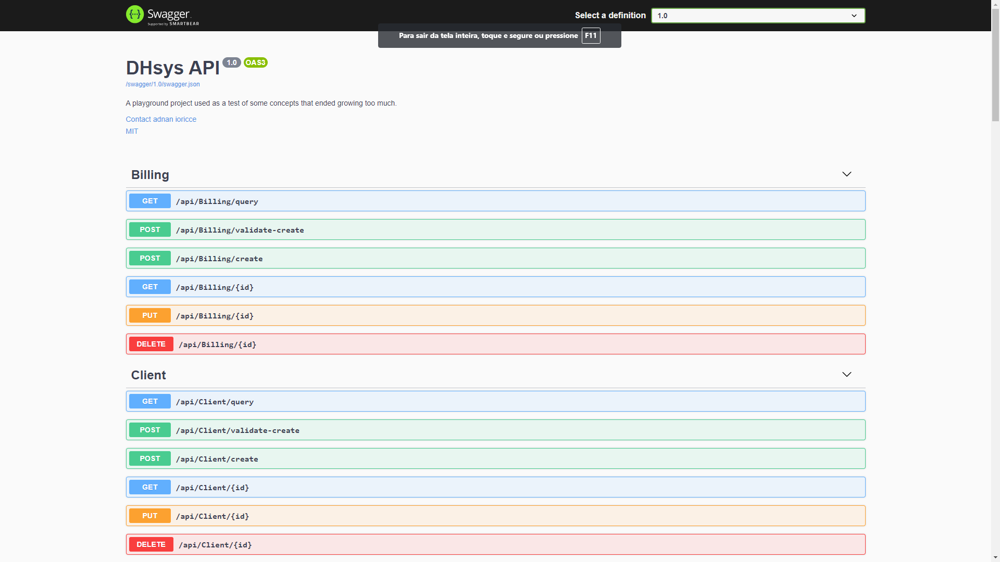

[](https://img.shields.io/github/license/adnanioricce/DHsys)


# DHsys
DHsys is a little side project of mine that I create to replicate a POS system in a pharmacy in a more "modern" way(meaning, not written in clipper). The project is separated between it's Web API and his Libraries. Currently, this is just a playground that I Will keep for a little while
# How to Build and run the Api project

## With source code

The following is required to build and run the project:

- .Net Core sdk 3.1 or Higher
- Postgresql 10 or higher

If you have the requirements, just follow the steps:

- Create a database in the postgresql server. By default, the projects expects a database with name dhsysdb
- if needed, update database connection string in the appsettings.json on src/Presentation/Api/appsettings.json .
- run the project
- Go to http://localhost:5000/api
## With Docker

start a postgresql container.

```docker run --name dhsysdb -e POSTGRES_PASSWORD=postgres -e POSTGRES_DB=dhsysdb -d postgres```

start a dhsysdb container with a db container host and connection string 
```docker run --name dhsys-api -p 5000:5000 -e DH_CONNECTION_STRING=User ID=postgres;Password=postgres;Host=dhsysdb;Port=5432;Database=dhsysdb;Pooling=true; -d dhsysapi```

you should be seeing this screen:

## Use CI Build
You can access a CI build of the project in [DHsys CI](http://dhsysapi.adnangonzagaci.com/api/v1/)

# Using the Web Api
## Crud Methods
Each entity has basic CRUD endpoints

Create: ``POST /api/{entity}/create?api-version=1.0``

Read: ``GET /api/{entity}?api-version=1.0&id=79001``

Update: ``PUT /api/{entity}?api-version=1.0&id=79001``

Delete: ``DELETE /api/{entity}?api-version=1.0&id=79001``

Create Validation: ``POST /api/{entity}/validate-create?api-version=1.0``

to use Create,Update and Create Validation endpoints, you need to send the object in the body request

## Query entries with OData
You can query entity data with OData in the ``/api/{entity}/query`` endpoint
Some examples 

Top: ``/api/Product/query?api-version=1.0&$top=100``
```json
[
{
"productSuppliers": [],
"productPrices": [],
"stockentries": [],
"productMedias": [],
"shelfLifes": [],
"categories": [],
"stockChanges": [],
"productTaxes": [],
"id": 1,
"uniqueCode": "277fee87-008b-4c24-ac3c-47e187dbd6b4",
"isDeleted": false,
"createdAt": "2021-01-25T20:26:58.549588+00:00",
"lastUpdatedOn": "2021-01-25T20:26:58.549451+00:00",
"baseProductId": null,
"manufacturerId": null,
"manufacturerName": "HOWMEDICA OSTEONICS CORP",
"manufacturerCountry": "ESTADOS UNIDOS DA AMÉRICA",
"riskClass": 2,
"name": "NÚCLEOS ACETABULARES",
"commercialName": "INSERTE ACETABULAR CONSTRITO TRIDENT",
"classification": null,
"concentration": 0,
"fisicForm": null,
"dosage": null,
"absoluteDosageInMg": null,
"activePrinciple": null,
"lotNumber": null,
"prescriptionNeeded": false,
"useRestriction": "Unknown Restriction",
"isPriceFixed": false,
"digitalBuleLink": null,
"laboratoryCode": null,
"laboratoryName": null,
"ncm": null,
"quantityInStock": 0,
"lastStockEntry": null,
"reorderLevel": 0,
"reorderQuantity": 0,
"endCustomerPrice": 0,
"costPrice": 0,
"savingPercentage": 0,
"barCode": null,
"description": null,
"section": null,
"maxDiscountPercentage": 0,
"discountValue": 0,
"commission": null,
"icms": 18,
"minimumStock": 1,
"mainSupplierName": null,
"ownerOfRegistry": "STRYKER DO BRASIL LTDA",
"registryCode": "80005430580",
"registryPublicationDate": "2020-06-01T00:00:00",
"dateOfRegistryUpdate": "2020-12-25T07:00:01+00:00",
"registryValidity": "06/01/2030 00:00:00",
"medicalProductModel": "69-2852 - Inserte Constrito Trident All Poly 28mm/ 52mm",
"stripe": 0
},
//others items...
]```

Select: ``/api/Product/query?api-version=1.0&$top=100&$select=uniqueCode,name,commercialName,manufacturerName,manufacturerCountry``

```json
[
{
"uniqueCode": "277fee87-008b-4c24-ac3c-47e187dbd6b4",
"name": "NÚCLEOS ACETABULARES",
"commercialName": "INSERTE ACETABULAR CONSTRITO TRIDENT",
"manufacturerName": "HOWMEDICA OSTEONICS CORP",
"manufacturerCountry": "ESTADOS UNIDOS DA AMÉRICA"
},
//others items...
]
```

OrderBy: ``/api/Product/query?api-version=1.0&$top=100&$select=id,uniqueCode,name,commercialName,manufacturerName,manufacturerCountry&$orderBy=id``

```json
[
{
"id": 1,
"uniqueCode": "277fee87-008b-4c24-ac3c-47e187dbd6b4",
"name": "NÚCLEOS ACETABULARES",
"commercialName": "INSERTE ACETABULAR CONSTRITO TRIDENT",
"manufacturerName": "HOWMEDICA OSTEONICS CORP",
"manufacturerCountry": "ESTADOS UNIDOS DA AMÉRICA"
},
//...
]
```


Filter: ``/api/Product/query?api-version=1.0&$top=100&$select=id,uniqueCode,name,riskClass&$filter=id eq 79001``

```json
[
{
"id": 79001,
"uniqueCode": "7bcf6532-7d6d-45cb-a5a9-d87ea2879a70",
"name": "ATIVIDADE DE ISOENZIMA CREATINOQUINASE",
"riskClass": 2
}
]
```
