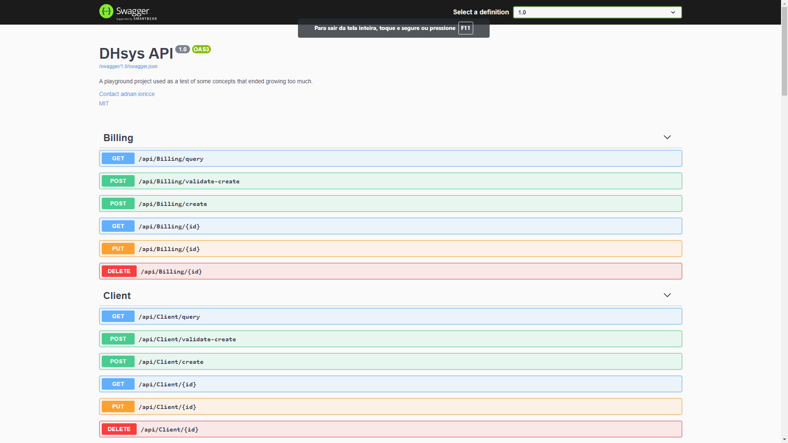

# How to Build and run the Api project

## With source code

The following is required to build and run the project:

- .Net Core sdk 3.1 or Higher
- Postgresql 10 or higher

If you have the requirements, just follow the steps:

- Create a database in the postgresql server. By default, the projects expects a database with name dhsysdb
- update database connection string in the appsettings.json on src/Presentation/Api/appsettings.json if needed.
- run the project
- Go to http://localhost:5000/api
## With Docker

start a postgresql container.

```docker run --name dhsysdb -e POSTGRES_PASSWORD=postgres -e POSTGRES_DB=dhsysdb -d postgres```

start a dhsysdb container with a db container host and connection string 
```docker run --name dhsys-api -p 5000:5000 -e DH_CONNECTION_STRING=User ID=postgres;Password=postgres;Host=dhsysdb;Port=5432;Database=dhsysdb;Pooling=true; -d dhsysapi```

go to http://localhost:5000/api

you should be seeing this screen
